# F1TENTH Software Algorithms Portfolio

> ROS 2 기반 F1TENTH 자율주행 알고리즘 구현 포트폴리오입니다.  
> Wall Following, Gap Following, Pure Pursuit, RRT* Local Planning을 각각 독립적인 주행 알고리즘으로 구현하고, 시뮬레이션/실습 환경에서 주행 결과를 검증했습니다.

본 저장소는 단순한 코드 모음이 아니라, F1TENTH 자율주행 수업에서 다룬 이론을 실제 ROS 2 노드로 구현하고 실험한 과정을 정리한 포트폴리오입니다. 각 알고리즘은 입력 센서, 제어 목표, 주행 명령 생성 방식이 다르기 때문에 서로 독립적인 모듈로 구성했습니다.

---

## Project Overview

| Module | Goal | Core Idea | Main Code |
|---|---|---|---|
| Wall Following | 벽과 일정 거리 유지 | LiDAR 거리 오차를 PID 제어로 조향각 변환 | `projects/wall-following/src/wall_follow_node.py` |
| Gap Following | map 없이 장애물 회피 | LiDAR free space에서 안전한 gap 선택 | `projects/gap-following/src/gap_following_node.py` |
| Pure Pursuit | waypoint 기반 경로 추종 | lookahead target을 선택하고 곡률 기반 조향 계산 | `projects/pure-pursuit/src/pure_pursuit_node.py` |
| RRT* Local Planning | local obstacle avoidance path 생성 | occupancy grid 위에서 collision-free path 탐색 | `projects/rrt-star/src/rrt_node.py` |

---

## 1. Wall Following

Wall Following은 차량이 벽과 일정한 거리를 유지하면서 주행하도록 하는 feedback control 문제입니다. 목표 거리를 reference로 두고, LiDAR로 측정한 실제 거리와의 error를 계산한 뒤 PID 제어를 통해 steering angle을 결정합니다.

<a href="projects/wall-following/media/wall_following_rviz_demo.mp4">
  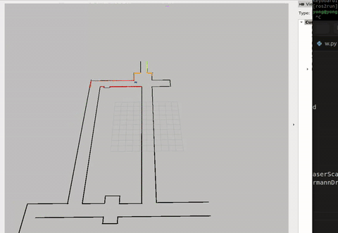
</a>

### Theory Background

강의 자료에서는 Wall Following의 목표를 **centerline을 따라 주행하면서 벽과 평행한 자세를 유지하는 것**으로 설명합니다. 또한 feedback control에서는 reference와 current state의 차이인 error를 줄이는 방향으로 control input을 생성합니다.

<p>
  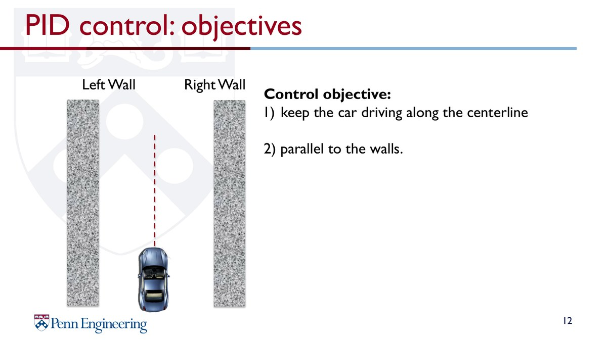
  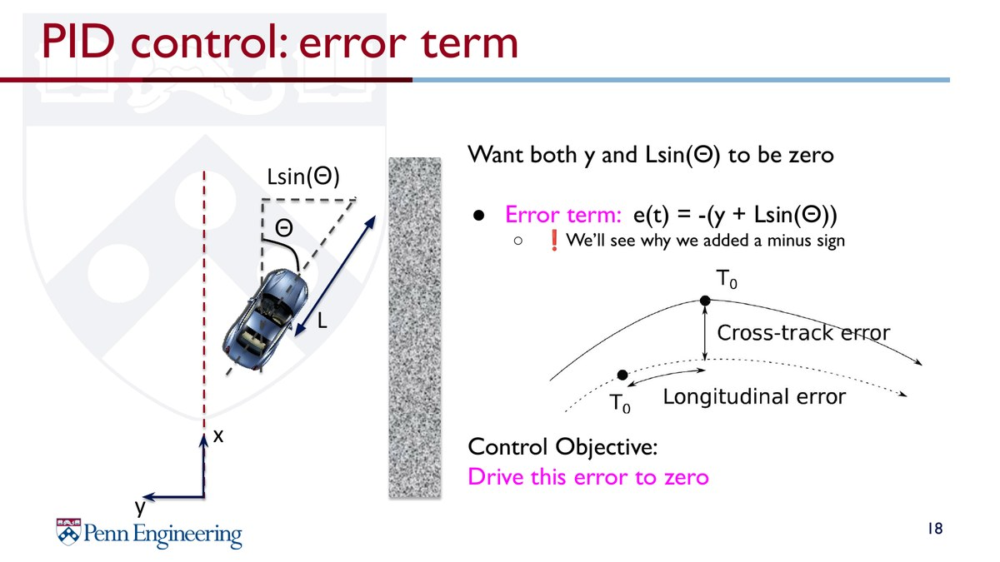
</p>

### Flow

```text
2D LiDAR Scan
      │
      ▼
Wall Distance Estimation
      │
      ▼
PID Error Control
      │
      ▼
Steering & Speed Selection
      │
      ▼
Ackermann Drive Command
      │
      ▼
F1TENTH Vehicle / Simulator
```

### Implementation Focus

- LiDAR range 값을 이용한 벽 거리 및 벽 기울기 추정
- 목표 거리와 예측 거리의 error 계산
- `P`, `I`, `D` gain 기반 steering angle 제어
- 조향각이 커질수록 속도를 낮추는 speed scheduling 적용
- RViz/시뮬레이션 환경에서 controller tuning 반복

---

## 2. Gap Following

Gap Following은 map 없이 현재 LiDAR scan만 이용해 주행 가능한 free space를 찾는 reactive obstacle avoidance 알고리즘입니다. 이 프로젝트에서는 단순히 가장 먼 점을 선택하는 방식이 아니라, safety bubble과 disparity extension을 적용하여 차량 폭과 장애물 경계를 고려했습니다.

<a href="projects/gap-following/media/gap_following_visual_demo.mp4">
  
</a>

<a href="projects/gap-following/media/gap_following_lap_demo.mp4">
  
</a>

### Theory Background

Follow the Gap의 핵심은 일정 거리 threshold를 넘는 LiDAR beam들의 연속 구간을 gap으로 보고, 그중 차량이 통과할 수 있는 안전한 방향을 선택하는 것입니다. 강의 자료에서는 nearest obstacle 주변을 safety bubble로 제거한 뒤, 남은 free space에서 max-gap과 best point를 선택하는 절차를 설명합니다.

<p>
  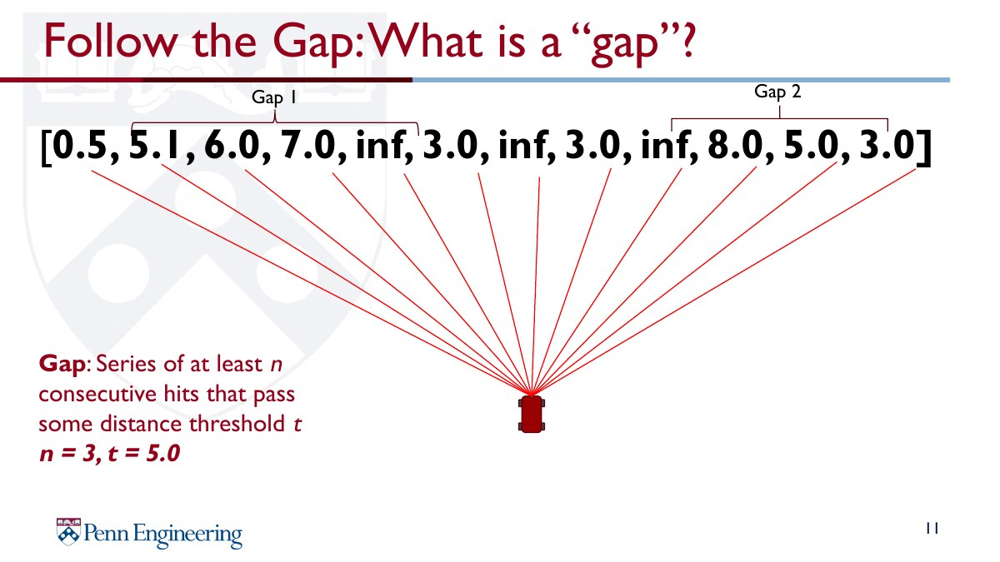
  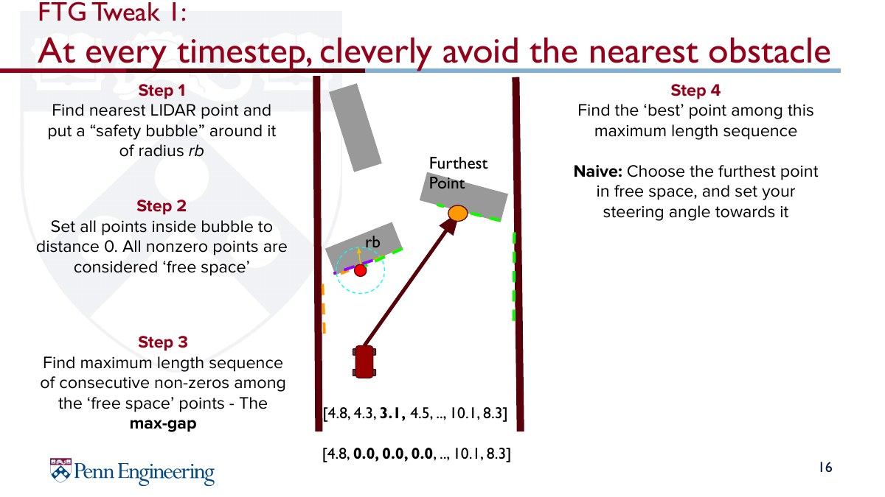
</p>

또한 disparity extender는 인접 LiDAR beam 사이의 큰 거리 차이를 장애물 경계로 보고, 차량 폭만큼 위험 영역을 확장하여 실제 차체가 통과할 수 없는 gap을 선택하지 않도록 보정합니다.

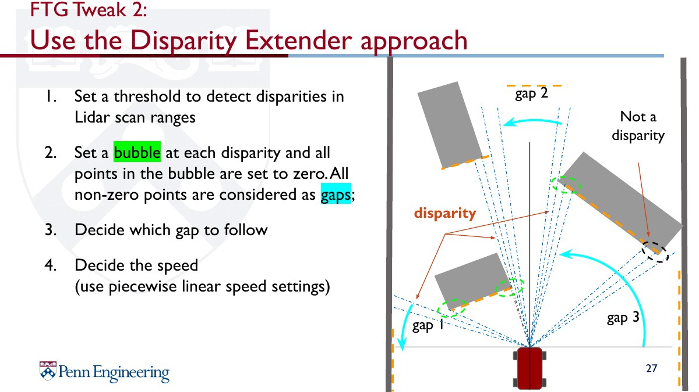

### Flow

```text
2D LiDAR Scan
      │
      ▼
LiDAR Preprocessing
      │
      ▼
Disparity Extension
      │
      ▼
Safety Bubble
      │
      ▼
Best Gap Selection
      │
      ▼
Emergency / Corner Safety Check
      │
      ▼
Steering & Speed Control
      │
      ▼
Ackermann Drive Command
      │
      ▼
F1TENTH Vehicle / Simulator
```

### Implementation Focus

- LiDAR range clipping, smoothing, front FOV filtering
- disparity threshold 기반 장애물 경계 감지
- 차량 폭과 safety margin을 반영한 위험 영역 확장
- max-gap 안에서 best point 선택
- wiggling을 줄이기 위한 steering smoothing 및 distance threshold 적용
- 전방 거리와 steering angle에 따른 speed profile 조정

---

## 3. Pure Pursuit

Pure Pursuit는 waypoint를 따라 차량을 주행시키는 geometric path tracking 알고리즘입니다. 현재 차량 위치에서 일정 lookahead distance만큼 떨어진 target point를 선택하고, 해당 target을 향해 차량이 따라가도록 곡률과 steering angle을 계산합니다.

<a href="projects/pure-pursuit/media/pure_pursuit_demo.mp4">
  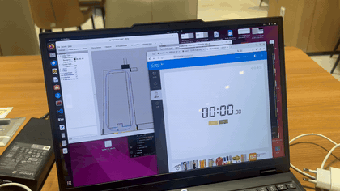
</a>

<p>
  
  
</p>

### Theory Background

Pure Pursuit는 차량이 주어진 waypoint sequence를 알고 있고, localization을 통해 waypoint가 차량 좌표계에서 어디에 있는지 알 수 있다는 가정 위에서 동작합니다. Lookahead distance `L`은 Pure Pursuit의 핵심 parameter이며, 작게 설정하면 더 공격적으로 조향하고 크게 설정하면 더 부드럽지만 tracking error가 커질 수 있습니다.

<p>
  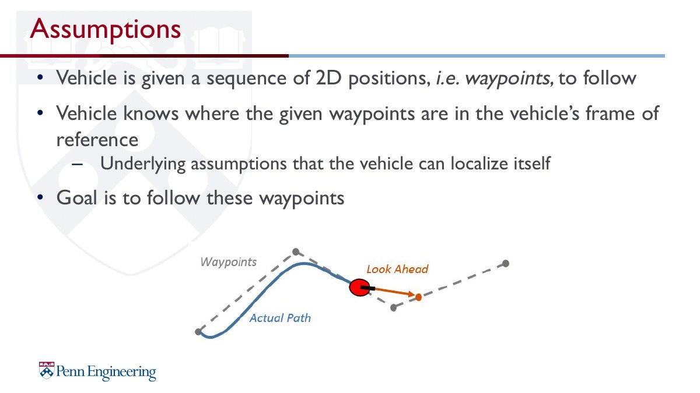
  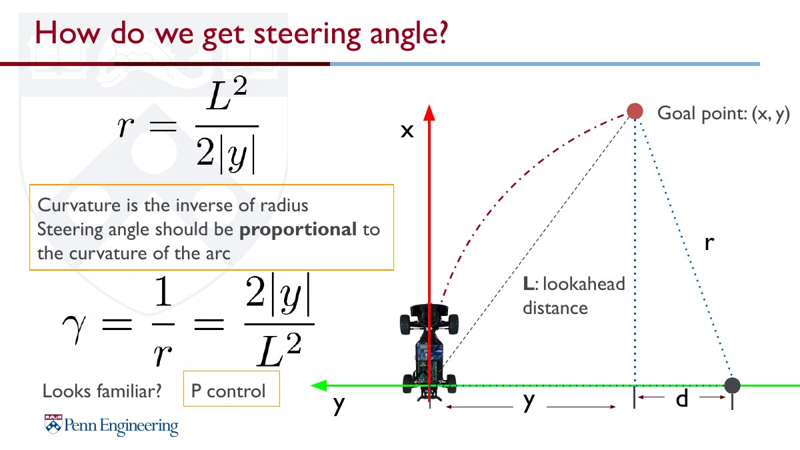
</p>

### Flow

```text
Waypoint CSV
      │
      ▼
Vehicle Odometry
      │
      ▼
Nearest Waypoint Search
      │
      ▼
Dynamic Lookahead Target
      │
      ▼
Pure Pursuit Steering
      │
      ▼
Curvature / Steering-based Speed Control
      │
      ▼
Ackermann Drive Command
      │
      ▼
F1TENTH Vehicle / Simulator
```

### Implementation Focus

- waypoint CSV 기반 target point 추종
- vehicle frame 기준 target point 변환
- dynamic lookahead 및 nearest waypoint search
- 곡률/조향각 기반 코너 감속
- speed smoothing을 이용한 급격한 가감속 완화
- RViz marker로 waypoint와 target point 시각화

> 실행 시 `waypoints.csv`가 필요합니다. 업로드된 정리본은 코드 중심으로 정리되어 있으므로, 실제 실행 환경에서는 사용한 waypoint 파일을 ROS 2 package share 경로 또는 실행 디렉터리에 함께 배치해야 합니다.

---

## 4. RRT* Local Planning

RRT* Local Planning은 LiDAR 기반 local occupancy grid 위에서 장애물을 피하는 collision-free path를 생성하는 sampling-based planning 방식입니다. 본 구현에서는 주행 경로가 장애물로 막힌 경우 RRT*를 이용해 local path를 만들고, 생성된 path를 Pure Pursuit 방식으로 추종하도록 구성했습니다.

<a href="projects/rrt-star/media/rrt_star_demo.mp4">
  
</a>

<p>
  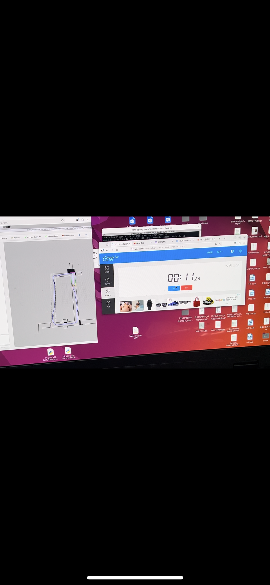
  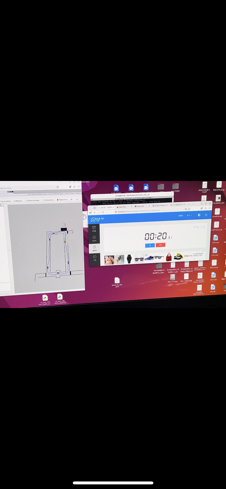
</p>

### Theory Background

Motion planning은 start configuration에서 goal configuration까지 장애물과 충돌하지 않는 path를 찾는 문제입니다. 실습에서는 continuous space를 occupancy grid로 근사하고, grid cell을 free/occupied state로 표현하여 collision checking을 수행했습니다.

<p>
  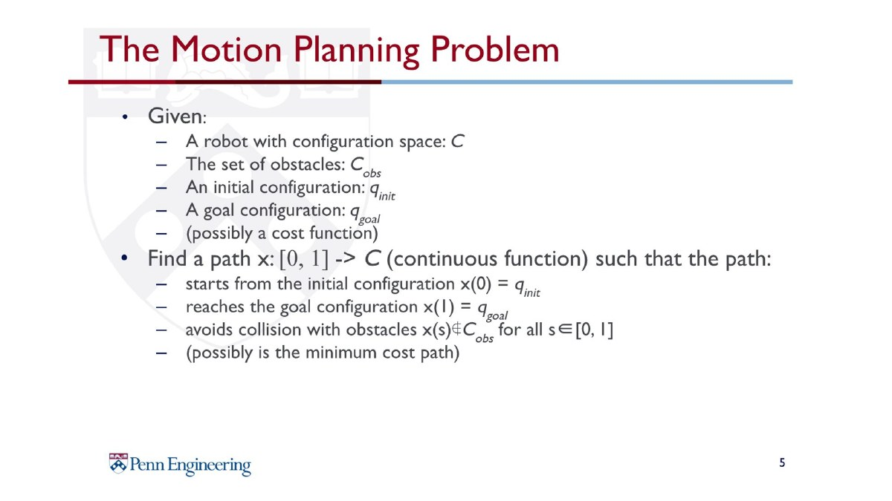
  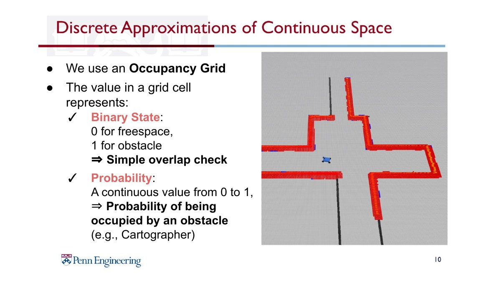
</p>

RRT는 random sample을 생성하고 nearest node와 연결하면서 tree를 확장합니다. RRT*는 여기에 rewiring을 추가하여 더 낮은 cost의 path를 찾도록 개선한 방식입니다.

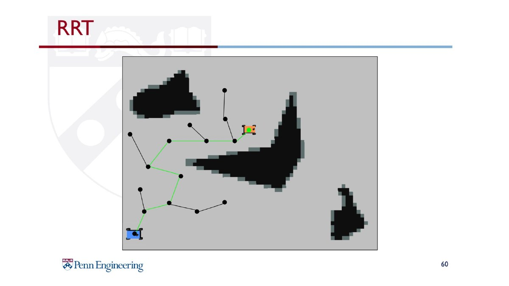

### Flow

```text
2D LiDAR Scan
      │
      ▼
Local Occupancy Grid
      │
      ▼
Path Blockage Check
      │
      ▼
RRT* Sampling & Rewiring
      │
      ▼
Collision-free Local Path
      │
      ▼
Pure Pursuit Path Tracking
      │
      ▼
Ackermann Drive Command
      │
      ▼
F1TENTH Vehicle / Simulator
```

### Implementation Focus

- LiDAR scan 기반 local occupancy grid 생성
- obstacle inflation을 통한 차량 크기 반영
- path blockage check 후 RRT* mode 진입
- random sampling, nearest node search, collision checking, rewiring 구현
- RRT* path shortcut 및 Pure Pursuit 기반 local path tracking
- RViz에서 occupancy grid, RRT* tree, path, goal marker 시각화

> `rrt_node.py`는 debug flag가 포함되어 있습니다. 실제 주행 모드에서는 `USE_FIXED_FRONT_RRT_GOAL`, `FIXED_RRT_GOAL_STOP` 같은 설정을 주행 목적에 맞게 확인해야 합니다.

---

## Repository Structure

```text
f1tenth_software_algorithms_portfolio/
├── README.md
├── docs/
│   ├── algorithm_notes.md
│   ├── theory_notes.md
│   ├── theory-assets/
│   ├── wall_following_design_notes.md
│   └── gap_lap_time_notes.md
└── projects/
    ├── wall-following/
    │   ├── README.md
    │   ├── src/
    │   └── media/
    ├── gap-following/
    │   ├── README.md
    │   ├── src/
    │   └── media/
    ├── pure-pursuit/
    │   ├── README.md
    │   ├── src/
    │   └── media/
    └── rrt-star/
        ├── README.md
        ├── src/
        └── media/
```

---

## Tech Stack

- ROS 2
- Python 3
- F1TENTH / Ackermann Steering
- 2D LiDAR
- RViz
- NumPy
- AckermannDriveStamped
- Occupancy Grid
- PID Control
- Pure Pursuit
- RRT*

---

## What I Focused On

이 프로젝트에서 중점적으로 다룬 부분은 단순히 알고리즘을 실행하는 것이 아니라, 실제 주행 상황에서 발생하는 문제를 줄이기 위한 tuning과 안정화였습니다.

- 직선 구간에서 속도를 높이면서도 코너 진입 시 감속하도록 speed profile 조정
- LiDAR noise와 벽 근접 상황에서 조향이 흔들리지 않도록 smoothing 적용
- 장애물 주변에서 bubble과 safety margin을 조정하여 충돌 가능성 완화
- waypoint 추종 중 lookahead 및 speed control 적용
- RRT* tree, target point, best gap 등을 RViz marker로 시각화하여 디버깅 효율 향상

---

## References

이론 설명과 일부 그림은 업로드한 F1TENTH 강의 자료를 바탕으로 정리했습니다. 원본 PDF에서 필요한 슬라이드만 `docs/theory-assets/`에 추출해 README와 프로젝트 설명에 포함했습니다.

- `[F1Tenth] L03 Reactive Methods_ Wall-following (based on UPenn).pdf`
- `[F1Tenth] L04 Reactive Methods - Follow the Gap-5.pdf`
- `[F1Tenth] L05 Pure Pursuit.pdf`
- `[F1Tenth] L06 Motion Planning.pdf`

---
