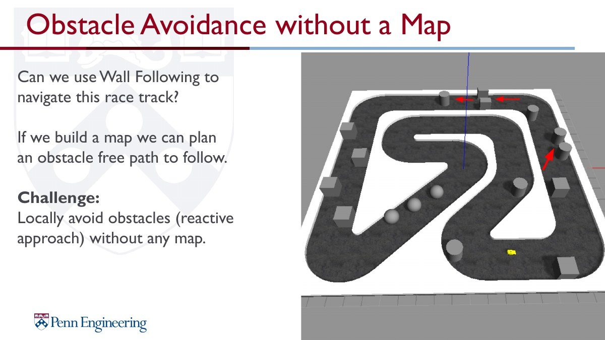
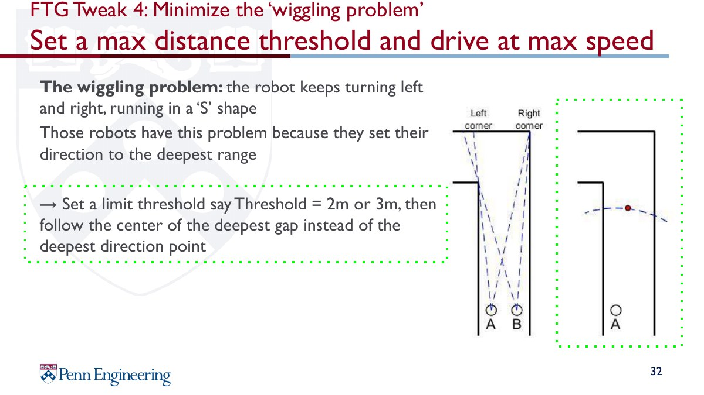

# Gap Following

LiDAR 기반 reactive obstacle avoidance 알고리즘입니다. Map이나 global path 없이 현재 LiDAR scan에서 주행 가능한 free space를 찾고, 가장 안전한 gap을 선택하여 조향각과 속도를 결정합니다.

## Demo

<a href="media/gap_following_visual_demo.mp4"></a>
<a href="media/gap_following_lap_demo.mp4"></a>

## Theory Background

Follow the Gap은 threshold를 넘는 연속 LiDAR beam 구간을 gap으로 정의하고, 그중 차량이 통과하기에 가장 적절한 방향을 선택하는 방법입니다. 단순히 가장 먼 point를 선택하면 차량 폭과 장애물 경계를 고려하지 못할 수 있기 때문에, safety bubble과 disparity extension이 필요합니다.

<p>
  
  
</p>

<p>
  
  
</p>

## Main Code

```text
src/gap_following_node.py
src/reverse_gap.py
```

## Flow

```text
2D LiDAR Scan
      │
      ▼
LiDAR Preprocessing
      │
      ▼
Disparity Extension
      │
      ▼
Safety Bubble
      │
      ▼
Best Gap Selection
      │
      ▼
Emergency / Corner Safety Check
      │
      ▼
Steering & Speed Control
      │
      ▼
Ackermann Drive Command
```

## Implementation Notes

- LiDAR range clipping, smoothing, front FOV selection
- disparity threshold 기반 장애물 경계 검출
- 차량 폭과 safety margin을 반영한 bubble 확장
- gap 중심 또는 best point 선택
- emergency stop / corner safety override
- steering smoothing 및 speed profile tuning
- `/best_point_marker`, `/bubble_point_marker` 시각화
