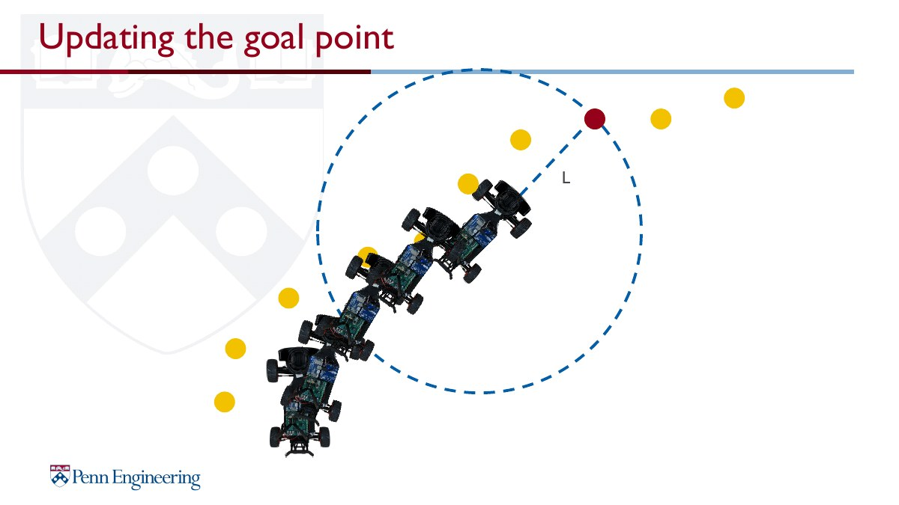

# Pure Pursuit

Waypoint 기반 경로 추종 알고리즘입니다. 현재 odometry와 waypoint CSV를 이용해 lookahead target을 선택하고, Pure Pursuit 기하학으로 steering angle을 계산합니다.

## Demo

<a href="media/pure_pursuit_demo.mp4"></a>

<p>
  
  
</p>

## Theory Background

Pure Pursuit는 차량이 추종할 waypoint sequence를 알고 있고, localization을 통해 waypoint를 차량 좌표계 기준으로 표현할 수 있다는 가정에서 동작합니다. Lookahead distance `L`은 조향 민감도를 결정하는 핵심 parameter이며, 작을수록 공격적인 조향, 클수록 부드럽지만 큰 tracking error를 만들 수 있습니다.

<p>
  
  
</p>


## Main Code

```text
src/pure_pursuit_node.py
```

## Flow

```text
Waypoint CSV
      │
      ▼
Vehicle Odometry
      │
      ▼
Nearest Waypoint Search
      │
      ▼
Dynamic Lookahead Target
      │
      ▼
Pure Pursuit Steering
      │
      ▼
Curvature / Steering-based Speed Control
      │
      ▼
Ackermann Drive Command
```

## Implementation Notes

- waypoint CSV 형식: `x, y, heading, speed`
- speed-dependent dynamic lookahead
- future curvature 기반 코너 사전 감속
- steering angle 기반 speed limit
- speed smoothing 및 steering smoothing
- waypoint / target marker RViz 시각화

## Runtime Note

실행 시 `waypoints.csv`가 필요합니다. 실제 ROS 2 package 환경에서는 package share directory 또는 실행 디렉터리에 waypoint 파일을 배치해야 합니다.
