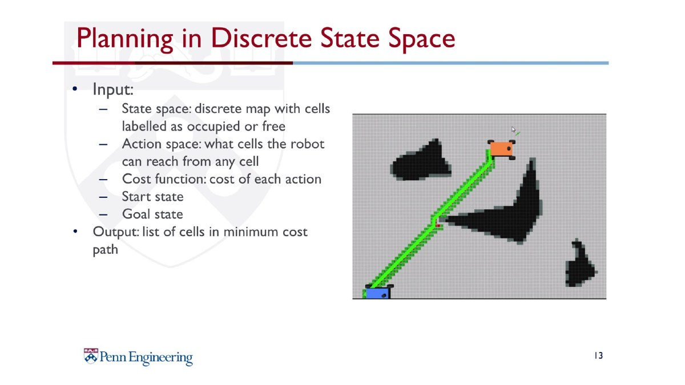

# RRT* Local Planning

LiDAR 기반 occupancy grid를 생성하고, Pure Pursuit 경로가 막혔을 때 RRT*로 local avoidance path를 생성하는 알고리즘입니다.

## Demo

<a href="media/rrt_star_demo.mp4"></a>

<p>
  
  
</p>

## Theory Background

Motion planning은 시작 configuration에서 목표 configuration까지 장애물과 충돌하지 않는 path를 찾는 문제입니다. 이 구현에서는 LiDAR scan을 local occupancy grid로 변환하고, occupied/free cell을 기준으로 collision checking을 수행했습니다.

<p>
  
  
</p>

## Main Code

```text
src/rrt_node.py
```

## Flow

```text
2D LiDAR Scan
      │
      ▼
Local Occupancy Grid
      │
      ▼
Path Blockage Check
      │
      ▼
RRT* Sampling & Rewiring
      │
      ▼
Collision-free Local Path
      │
      ▼
Pure Pursuit Path Tracking
      │
      ▼
Ackermann Drive Command
```

## Implementation Notes

- LiDAR scan을 local occupancy grid로 변환
- 장애물 inflation 적용
- path blockage check 후 RRT* mode 진입
- random sampling, nearest node, collision checking, rewiring 구현
- RRT* path shortcut 및 pure pursuit 방식 추종
- `/occupancy_grid`, `/rrt_star_tree`, `/path`, `/goal_marker`, `/target_marker` 시각화

## Runtime Note

코드 상단의 debug flag를 확인해야 합니다.

```python
USE_FIXED_FRONT_RRT_GOAL = True
FIXED_RRT_GOAL_STOP = True
```

위 설정은 RRT* goal과 tree를 확인하기 위한 debug mode입니다. 실제 주행 시에는 주행 목적에 맞게 flag를 수정해야 합니다.
