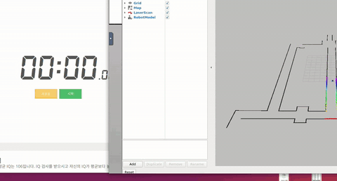
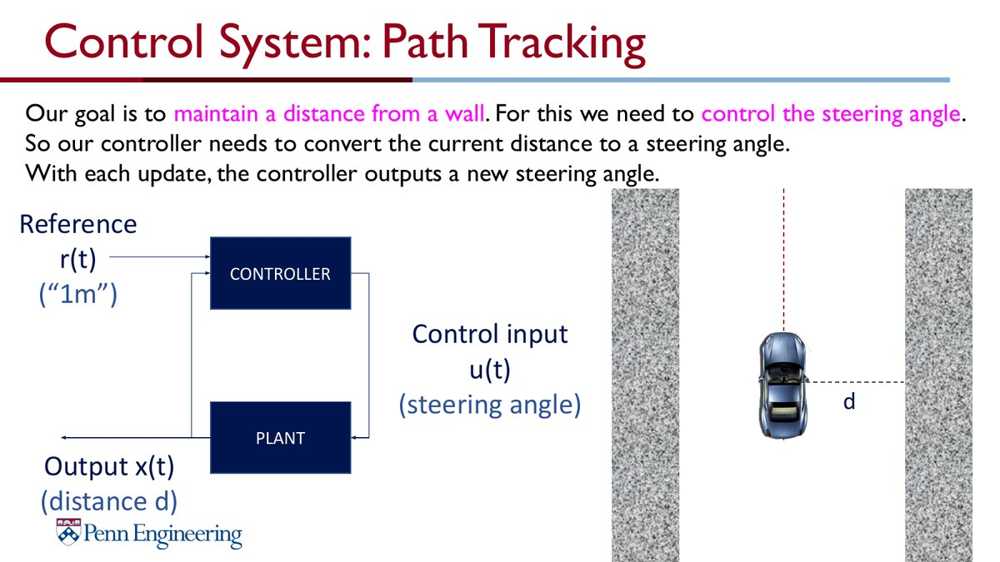
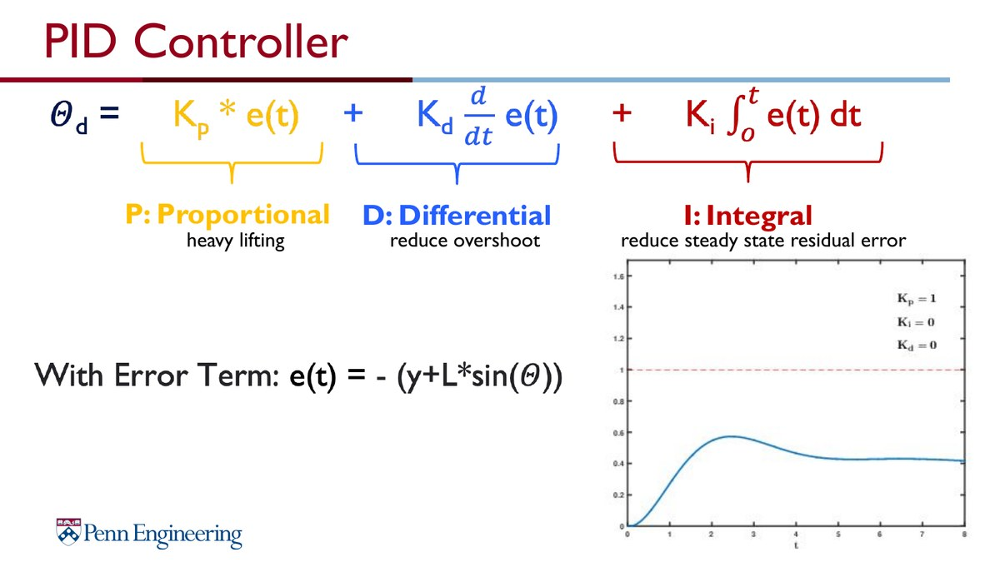

# Wall Following

LiDAR 기반 벽 추종 알고리즘입니다. 차량이 벽과 일정한 거리를 유지하도록 range data에서 거리 오차를 계산하고, PID 제어기를 통해 `/drive` Ackermann command를 생성합니다.

## Demo

<a href="media/wall_following_rviz_demo.mp4"></a>
<a href="media/wall_following_timer_demo.mp4"></a>

## Theory Background

Wall following은 reference distance와 실제 측정 distance 사이의 error를 줄이는 feedback control 문제입니다. 강의 자료에서는 차량이 centerline을 따라가면서 양쪽 벽과 평행하게 주행하는 것을 control objective로 설명합니다.

<p>
  
  
</p>

## Main Code

```text
src/wall_follow_node.py
```

## Flow

```text
2D LiDAR Scan
      │
      ▼
Wall Distance Estimation
      │
      ▼
PID Error Control
      │
      ▼
Steering & Speed Selection
      │
      ▼
Ackermann Drive Command
```

## Implementation Notes

- `/scan` 구독, `/drive` publish
- 두 각도 LiDAR range를 이용해 벽 기울기와 예측 거리 계산
- `kp`, `ki`, `kd` 기반 PID control
- 조향각 크기에 따른 속도 조절
- 전방 threshold를 이용한 특수 구간 처리
